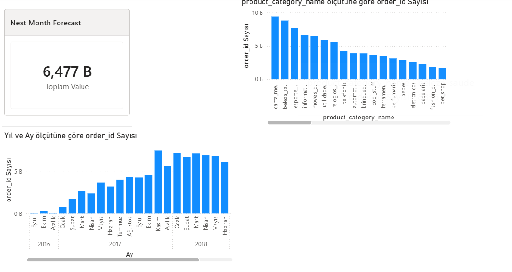

# 📦 E-Commerce Demand Forecasting & Inventory Optimization (Olist)

## 📌 Proje Özeti
Bu proje, Brezilya merkezli e-ticaret platformu Olist'in gerçek veritabanı kullanılarak geliştirilmiş **uçtan uca bir Endüstri Mühendisliği Karar Destek Sistemi**'dir. 

Python ile makine öğrenmesi modelleri kurularak gelecek ayın sipariş talebi tahmin edilmiş, ardından Power BI üzerinde Pareto (ABC) Analizi yapılarak operasyonel yük ve depo yerleşimi (slotting) stratejileri optimize edilmiştir.

## 🛠️ Kullanılan Teknolojiler
* **Veri Mimarisi & İşleme:** SQL, Python (Pandas, NumPy)
* **Makine Öğrenmesi (Tahmin):** Scikit-Learn (Linear Regression)
* **Veri Görselleştirme & İş Zekası:** Power BI (DAX, Data Modeling)

## 📊 Power BI Dashboard Görünüm

## 🚀 Proje Adımları ve Mühendislik Yaklaşımı
1. **Veri Temizleme ve Modelleme (Python/SQL):** Dağınık tablolar (Siparişler, Ürünler, Kalemler) temizlenerek analiz için merkezi bir Fact-Dimension şeması oluşturuldu.
2. **Gelecek Talep Tahmini (Machine Learning):** Geçmiş verilere dayalı olarak oluşturulan model ile **6.477** adetlik bir sonraki ay sipariş hacmi tahmin edildi.
3. **Pareto (ABC) Analizi (Power BI):** 80/20 kuralı gereği, en yüksek hareketliliğe sahip ürün kategorileri belirlendi (Örn: *Yatak/Banyo ve Güzellik/Sağlık*). Bu sayede JIT (Just-In-Time) ve envanter önceliklendirme stratejileri veri tabanlı hale getirildi.

## 💡 İş Çıktıları (Business Value)
Bu proje sayesinde bir şirket yöneticisi;
* Gelecek ay deponun ne kadar yoğun olacağını (6.477 sipariş) net bir şekilde görebilir.
* Operasyonel iş gücünün hangi A-Grubu ürünlere kaydırılması gerektiğini anlık analiz edebilir.
* Düşük hacimli C-Grubu ürünler için stok maliyetlerini azaltacak aksiyonlar alabilir.
